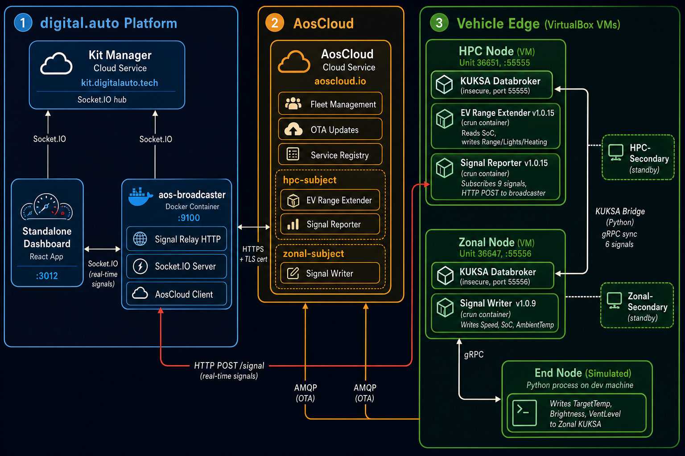
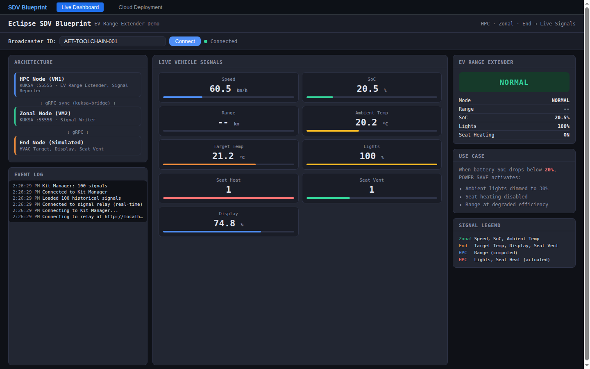
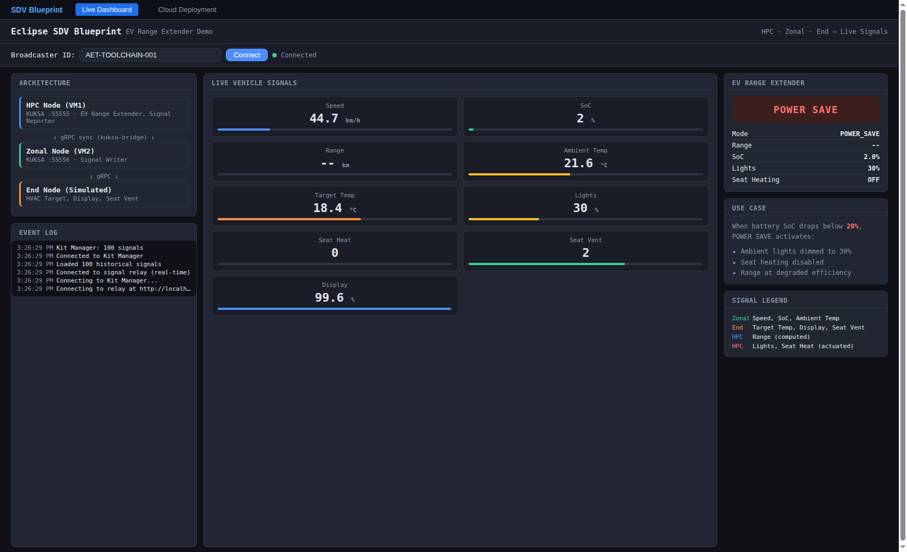
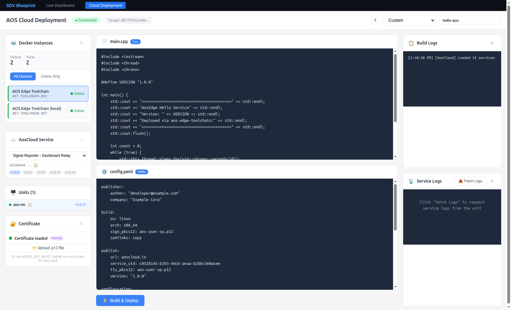

# Eclipse SDV Blueprint — Full System Guide

End-to-end demonstration of the Eclipse SDV Blueprint with EV Range Extender use case.
Signals flow across three simulated vehicle nodes (HPC, Zonal, End), are processed by
the EV Range Extender app, and appear live on a standalone browser dashboard.



---

## Architecture

The system has three main parts:

### 1. digital.auto Platform (Dev Machine)

| Component | Port | Purpose |
|---|---|---|
| **Kit Manager** | `kit.digitalauto.tech` | Socket.IO hub connecting dashboards and kits |
| **aos-broadcaster** | `:9100` (Docker) | Signal relay (HTTP + Socket.IO), AosCloud client, builds & deploys services |
| **Web Apps** | `:3010` | Dashboard (`/dashboard`) + Deployment UI (`/deploy`) |
| **KUKSA Bridge** | — (Python) | Syncs 6 signals from Zonal KUKSA → HPC KUKSA via gRPC |
| **End Simulator** | — (Python) | Writes simulated End-domain sensors to Zonal KUKSA |

### 2. AosCloud (`aoscloud.io`)

| Item | Details |
|---|---|
| **HPC Subject** (`hpc-subject`) | EV Range Extender + Signal Reporter → HPC Unit |
| **Zonal Subject** (`zonal-subject`) | Signal Writer → Zonal Unit |
| **OTA** | Pushes signed service packages to edge units via AMQP |

### 3. Vehicle Edge (VirtualBox VMs)

| Node | Unit | KUKSA Port | Services |
|---|---|---|---|
| **HPC-Main** | 36651 (`3fa22dc2...`) | 55555 | EV Range Extender v1.0.15, Signal Reporter v1.0.15 |
| **HPC-Secondary** | — | — | Standby |
| **Zonal-Main** | 36647 (`97f9e612...`) | 55556 | Signal Writer v1.0.10 |
| **Zonal-Secondary** | — | — | Standby |
| **End Node** | — | — | Simulated (Python on dev machine) |

### C++ Services (deployed via AosCloud OTA)

| Service | UUID | Target | What it does |
|---|---|---|---|
| Signal Writer | `242a46c7-...` | Zonal | Writes Speed, SoC, AmbientTemp every 2s |
| EV Range Extender | `bb539aaa-...` | HPC | Reads SoC → computes Range, actuates Lights/SeatHeat |
| Signal Reporter | `242dd4d4-...` | HPC | Subscribes to 9 signals, HTTP POSTs to broadcaster |

### Vehicle Signals (VSS paths)

| Signal | Source | Domain |
|---|---|---|
| `Vehicle.Speed` | Signal Writer | Zonal |
| `Vehicle.Powertrain.TractionBattery.StateOfCharge.Current` | Signal Writer | Zonal |
| `Vehicle.Cabin.HVAC.AmbientAirTemperature` | Signal Writer | Zonal |
| `Vehicle.Cabin.HVAC.TargetTemperature` | End Simulator | End |
| `Vehicle.Infotainment.Display.Brightness` | End Simulator | End |
| `Vehicle.Cabin.Seat.VentilationLevel` | End Simulator | End |
| `Vehicle.Powertrain.Range` | EV Range Extender | HPC (computed) |
| `Vehicle.Cabin.Lights.AmbientLight.Intensity` | EV Range Extender | HPC (actuated) |
| `Vehicle.Cabin.Seat.Heating` | EV Range Extender | HPC (actuated) |

### EV Range Extender Logic

```
EVERY 2 seconds:
  Read SoC from KUKSA

  IF SoC < 20%:
    mode = POWER_SAVE
    Lights.Intensity = 30   (dimmed)
    Seat.Heating = 0        (off)
    Range = SoC × 4.0 km    (degraded)
  ELSE:
    mode = NORMAL
    Lights.Intensity = 100
    Seat.Heating = 1
    Range = SoC × 5.5 km    (normal)
```

---

## Prerequisites

- **VirtualBox 7.1.x** (7.2.x has [a known bug](https://github.com/VirtualBox/virtualbox/issues/271))
- **Docker** running on your dev machine
- **Python 3.10+** with `pip`
- **Node.js 18+** with `npm`
- **AosCloud accounts**: OEM certificate (`.p12`) at `~/.aos/security/aos-user-oem.p12`
- **`aos-prov`**: install via `pip install aos-prov` (in `~/.aos/venv`)
- **`sshpass`**: `apt install sshpass`

### Corporate Proxy

If behind a corporate proxy, you **must** unset proxy vars for all commands that reach external services:

```bash
unset http_proxy https_proxy HTTP_PROXY HTTPS_PROXY FTP_PROXY ftp_proxy
```

The `aos-prov` tool, `pip`, `apt` (inside Docker), and Python gRPC all pick up proxy env vars and will fail if the proxy is unreachable.

---

## Step 1: Create AOS Edge Units

### 1.1 Provision the Zonal Unit

```bash
source ~/.aos/venv/bin/activate
unset http_proxy https_proxy HTTP_PROXY HTTPS_PROXY
aos-prov unit-new -N zonal-unit --nodes 2 --skip-check-version
```

Note the **System ID** and **Unit URL** from the output.

### 1.2 Provision the HPC Unit

```bash
aos-prov unit-new -N hpc-unit --nodes 2 --skip-check-version
```

### 1.3 Post-provisioning setup (required after every VM boot)

```bash
# Set SELinux to Permissive (required for crun containers)
sshpass -p 'Password1' ssh -p <SSH_PORT> root@localhost "setenforce 0"

# Fix DNS (corporate networks may block default)
sshpass -p 'Password1' ssh -p <SSH_PORT> root@localhost "
  mount -o remount,rw /
  mkdir -p /etc/systemd/resolved.conf.d
  printf '[Resolve]\nDNS=8.8.8.8 1.1.1.1\n' > /etc/systemd/resolved.conf.d/public-dns.conf
  systemctl restart systemd-resolved"

# Configure KUKSA Databroker for insecure mode
sshpass -p 'Password1' ssh -p <SSH_PORT> root@localhost "
  mount -o remount,rw /
  mkdir -p /etc/systemd/system/kuksa-databroker.service.d
  cat > /etc/systemd/system/kuksa-databroker.service.d/override.conf << 'EOF'
[Service]
ExecStart=
ExecStart=/usr/bin/databroker --vss /usr/share/vss/vss.json --address=0.0.0.0 --port <KUKSA_PORT> --insecure
EOF
  systemctl daemon-reload
  systemctl restart kuksa-databroker"
```

Replace `<SSH_PORT>` and `<KUKSA_PORT>` per VM (HPC: 55555, Zonal: 55556).

### 1.4 Upload merged VSS metadata

The stock KUKSA VSS doesn't include all blueprint signal paths. Copy the merged VSS to both VMs:

```bash
sshpass -p 'Password1' ssh -p <SSH_PORT> root@localhost "mount -o remount,rw /"
sshpass -p 'Password1' scp -P <SSH_PORT> sdv-blueprint/vss-merged.json root@localhost:/usr/share/vss/vss.json
sshpass -p 'Password1' ssh -p <SSH_PORT> root@localhost "systemctl restart kuksa-databroker"
```

If `vss-merged.json` doesn't exist, generate it:

```bash
cd sdv-blueprint
docker create --name kuksa-tmp ghcr.io/eclipse-kuksa/kuksa-databroker:latest
docker cp kuksa-tmp:/vss_release_5.1.json /tmp/vss_base.json
docker rm kuksa-tmp
python3 -c "
import json
with open('/tmp/vss_base.json') as f: base = json.load(f)
with open('vss-overlay.json') as f: overlay = json.load(f)
def merge(b, o):
    for k, v in o.items():
        if k in b and isinstance(b[k], dict) and isinstance(v, dict): merge(b[k], v)
        else: b[k] = v
merge(base, overlay)
with open('vss-merged.json', 'w') as f: json.dump(base, f)
print('vss-merged.json written')
"
```

### 1.5 Set up SSH tunnels for KUKSA access

VirtualBox NAT port forwarding does **not** reliably forward gRPC/HTTP2 traffic. Use SSH tunnels instead:

```bash
sshpass -p 'Password1' ssh -o StrictHostKeyChecking=no -f -N -L 55555:localhost:55555 -p <HPC_SSH_PORT> root@localhost
sshpass -p 'Password1' ssh -o StrictHostKeyChecking=no -f -N -L 55556:localhost:55556 -p <ZONAL_SSH_PORT> root@localhost
```

Verify:

```bash
python3 -c "
import grpc
from kuksa.val.v1 import val_pb2, val_pb2_grpc
for port, name in [(55555, 'HPC'), (55556, 'Zonal')]:
    stub = val_pb2_grpc.VALStub(grpc.insecure_channel(f'localhost:{port}'))
    resp = stub.GetServerInfo(val_pb2.GetServerInfoRequest(), timeout=5)
    print(f'{name}: {resp.name} {resp.version}')
"
```

---

## Step 2: Create Services in AosCloud

### 2.1 Get the toolchain Docker image

**Option A: Pull from GitHub Container Registry (recommended)**

```bash
docker pull ghcr.io/eclipse-autowrx/epam-service-connector/aos-edge-toolchain:latest
docker tag ghcr.io/eclipse-autowrx/epam-service-connector/aos-edge-toolchain:latest aos-edge-toolchain:latest
```

**Option B: Build locally**

```bash
cd aos-edge-toolchain
# If behind a corporate proxy, clear proxy vars first:
unset http_proxy https_proxy HTTP_PROXY HTTPS_PROXY FTP_PROXY ftp_proxy
docker build \
  --build-arg HTTP_PROXY= --build-arg HTTPS_PROXY= \
  --build-arg http_proxy= --build-arg https_proxy= \
  -t aos-edge-toolchain:latest .
```

The image includes all build tools (g++, protoc, gRPC, socket.io) out of the box — no runtime `apt install` needed.

### 2.2 Start the broadcaster

```bash
docker run -d --network host \
  --name aos-broadcaster \
  -v ~/.aos/security/aos-user-sp.p12:/certs/aos-user-sp.p12:ro \
  -v "$(pwd)/scripts/aos-broadcaster.js:/usr/local/bin/aos-broadcaster.js:ro" \
  -e INSTANCE_ID=AET-TOOLCHAIN-001 \
  -e INSTANCE_NAME="AOS Edge Toolchain" \
  -e KIT_MANAGER_URL=https://kit.digitalauto.tech \
  -e CERT_FILE=/certs/aos-user-sp.p12 \
  -e AOSCLOUD_URL=https://aoscloud.io:10000 \
  -e SIGNAL_RELAY_PORT=9100 \
  -e NODE_TLS_REJECT_UNAUTHORIZED=0 \
  --entrypoint sh \
  aos-edge-toolchain:latest \
  -c "unset http_proxy https_proxy HTTP_PROXY HTTPS_PROXY && \
      python3 /usr/local/bin/init-certs.py && \
      exec node /usr/local/bin/aos-broadcaster.js"
```

Verify: `docker logs aos-broadcaster 2>&1 | grep -E 'SignalRelay|Connected'`

### 2.3 Build C++ services

```bash
docker cp ./sdv-blueprint aos-broadcaster:/workspace/sdv-blueprint
docker exec aos-broadcaster env -i PATH=/usr/local/sbin:/usr/local/bin:/usr/sbin:/usr/bin:/sbin:/bin \
  HOME=/root bash -c "cd /workspace/sdv-blueprint && make all"
```

### 2.4 Deploy services to AosCloud

```bash
for SERVICE in signal-writer ev-range-extender signal-reporter; do
    docker exec aos-broadcaster env -i PATH=/usr/local/sbin:/usr/local/bin:/usr/sbin:/usr/bin:/sbin:/bin \
      HOME=/root bash -c "
      rm -rf /workspace/src /workspace/meta /workspace/service.tar.gz &&
      mkdir -p /workspace/src /workspace/meta &&
      cp /workspace/sdv-blueprint/build/$SERVICE /workspace/src/$SERVICE &&
      cp /workspace/sdv-blueprint/presets/${SERVICE}.yaml /workspace/meta/config.yaml &&
      touch /workspace/meta/default_state.dat &&
      cp /root/.aos/security/aos-user-sp.p12 /workspace/aos-user-sp.p12 &&
      cd /workspace &&
      /usr/local/bin/aos-toolkit.sh sign &&
      /usr/local/bin/aos-toolkit.sh upload"
done
```

### 2.5 Create subjects and assign units

Using the AosCloud API (with OEM certificate):

```bash
unset http_proxy https_proxy HTTP_PROXY HTTPS_PROXY
CERT=~/.aos/security/aos-user-oem.p12
API=https://oem.aoscloud.io:10000/api/v10

# List subjects
curl -sk --cert-type P12 --cert $CERT $API/subjects/

# Assign unit to subject
curl -sk --cert-type P12 --cert $CERT -X POST \
  -H "Content-Type: application/json" \
  -d '{"system_uids": ["<SYSTEM_ID>"]}' \
  $API/subjects/<SUBJECT_UUID>/units/
```

Or use the OEM portal at https://oem.aoscloud.io:
1. Create **hpc-subject** → assign EV Range Extender + Signal Reporter
2. Create **zonal-subject** → assign Signal Writer
3. Assign HPC Unit to hpc-subject, Zonal Unit to zonal-subject

Services will be pushed to units via OTA automatically.

---

## Step 3: Start Support Services

### 3.1 KUKSA Bridge (Zonal → HPC sync)

```bash
env -i PATH="$PATH" HOME="$HOME" PYTHONUNBUFFERED=1 \
  ZONAL_KUKSA_ADDR=localhost:55556 HPC_KUKSA_ADDR=localhost:55555 \
  python3 sdv-blueprint/kuksa-sync/kuksa-bridge.py &
```

### 3.2 End ECU Simulator

```bash
env -i PATH="$PATH" HOME="$HOME" PYTHONUNBUFFERED=1 \
  KUKSA_ADDR=localhost:55556 \
  python3 sdv-blueprint/end-simulator/simulator.py &
```

### 3.3 Web Apps (Dashboard + Deployment UI)

```bash
# Build both standalone bundles (one-time)
cd sdv-blueprint/dashboard && npm install && npx esbuild src/standalone.ts --bundle --format=iife --platform=browser --jsx=automatic --sourcemap --outfile=standalone.js
cd ../../aos-cloud-deployment && npm install && npx esbuild src/standalone.ts --bundle --format=iife --platform=browser --jsx=automatic --sourcemap --outfile=standalone.js

# Start unified server
cd ../sdv-blueprint
node server.js    # serves on http://localhost:3010
```

Open http://localhost:3010 — the nav bar lets you switch between:
- **Live Dashboard** (`/dashboard`) — real-time signal gauges
- **Cloud Deployment** (`/deploy`) — build & deploy services to AosCloud

On the Dashboard page, enter `AET-TOOLCHAIN-001`, click **Connect**.

The dashboard connects via:
- **Direct Socket.IO to broadcaster :9100** — real-time signal updates (instant)
- **Kit Manager Socket.IO** — fetches historical signals on connect (fallback)

---

## Step 4: Verify

### Dashboard — NORMAL mode (SoC > 20%)



### Dashboard — POWER SAVE mode (SoC < 20%)



### Cloud Deployment UI



### All 9 signals should show live values:

| Gauge | Source | Expected |
|---|---|---|
| Speed | Signal Writer | 10–70 km/h (oscillating) |
| SoC | Signal Writer | 80% → 0% (cycling every ~2 min) |
| Ambient Temp | Signal Writer | 17–27 °C (oscillating) |
| Target Temp | End Simulator | 18–26 °C |
| Display | End Simulator | 35–95% |
| Seat Vent | End Simulator | 0–3 |
| Range | EV Range Extender | Computed from SoC |
| Lights | EV Range Extender | 100% (normal) or 30% (power save) |
| Seat Heat | EV Range Extender | 1 (normal) or 0 (power save) |

### EV Range Extender mode switching:

When SoC drops below **20%**, the EV Range Extender panel switches to **POWER SAVE** (red):
- Lights dim from 100% → 30%
- Seat heating turns OFF
- Range computed at degraded efficiency (4.0 km/%)

When SoC cycles back above 20%, it returns to **NORMAL** (green).

---

## File Reference

```
sdv-blueprint/
├── README.md                       ← this file
├── Makefile                        ← C++ build (make protos && make all)
├── vss-overlay.json                ← custom VSS paths
├── vss-merged.json                 ← generated merged VSS
├── presets/
│   ├── signal-writer.cpp / .yaml   ← Signal Writer (→ Zonal)
│   ├── ev-range-extender.cpp / .yaml ← EV Range Extender (→ HPC)
│   └── signal-reporter.cpp / .yaml ← Signal Reporter (→ HPC)
├── dashboard/
│   ├── standalone.html             ← standalone entry point
│   ├── src/
│   │   ├── standalone.ts           ← mounts Dashboard component
│   │   ├── components/Dashboard.tsx ← main UI
│   │   ├── services/signal.service.ts ← Socket.IO to broadcaster
│   │   └── types/index.ts          ← signal types
│   └── package.json
├── kuksa-sync/
│   └── kuksa-bridge.py             ← Zonal→HPC signal sync
├── end-simulator/
│   └── simulator.py                ← End ECU sensor simulator
└── signal-reporter/
    └── reporter.py                 ← Python Signal Reporter (local demo alt)
```

---

## Related Guides

- [AosCloud Setup](../docs/AOSCLOUD_SETUP.md) — Services, subjects, units, API reference
- [Troubleshooting](../docs/TROUBLESHOOTING.md) — Known issues and solutions

## Troubleshooting

See [Troubleshooting Guide](../docs/TROUBLESHOOTING.md) for detailed solutions to common issues including:
- SELinux blocking crun containers
- DNS resolution failures on VMs
- KUKSA connection refused
- VirtualBox NAT port forwarding not working with gRPC
- Corporate proxy interference
- Custom VSS paths not found
- Provision state not set after VM reboot
- C++ services must use insecure gRPC (no TLS certs in crun containers)
